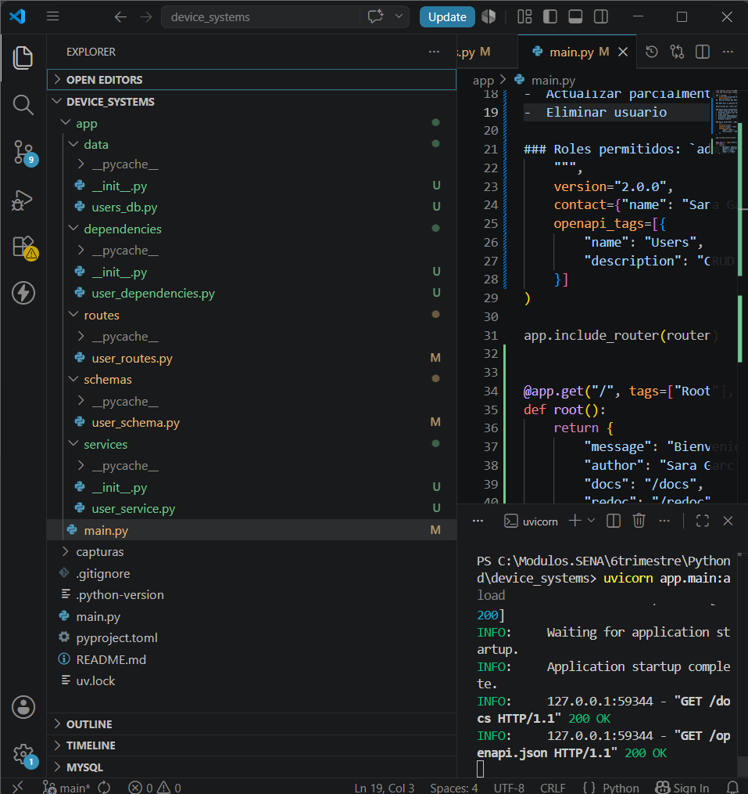
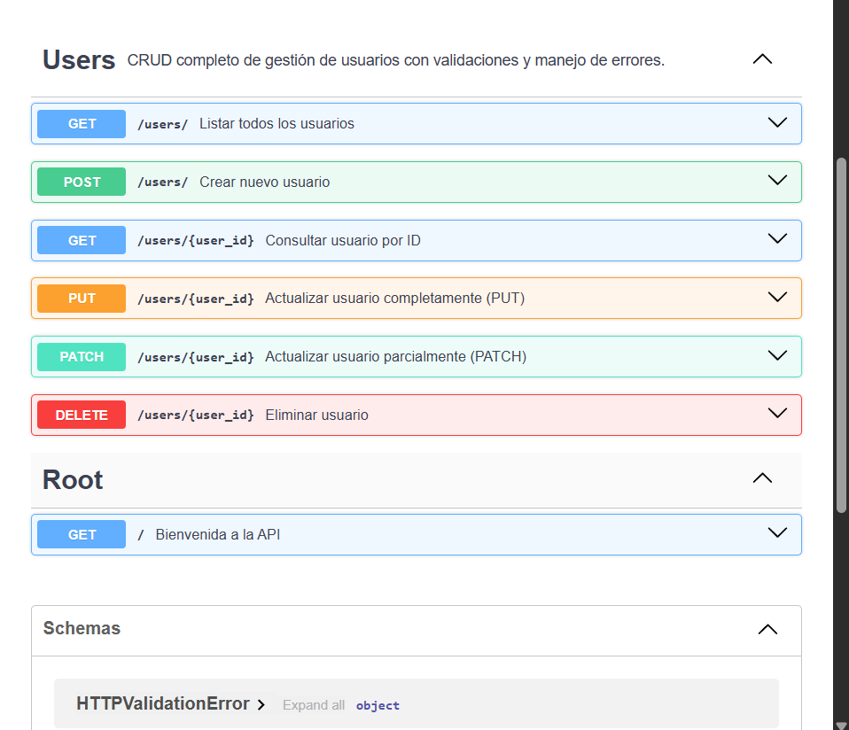
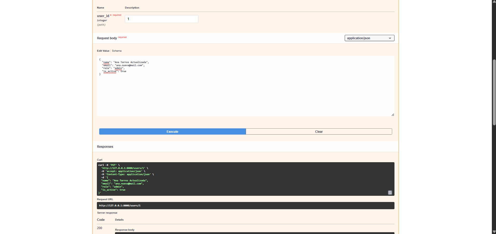
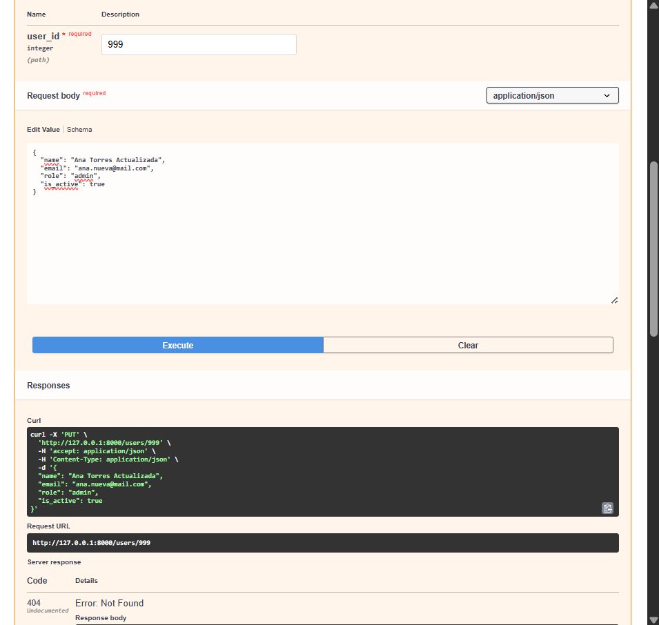
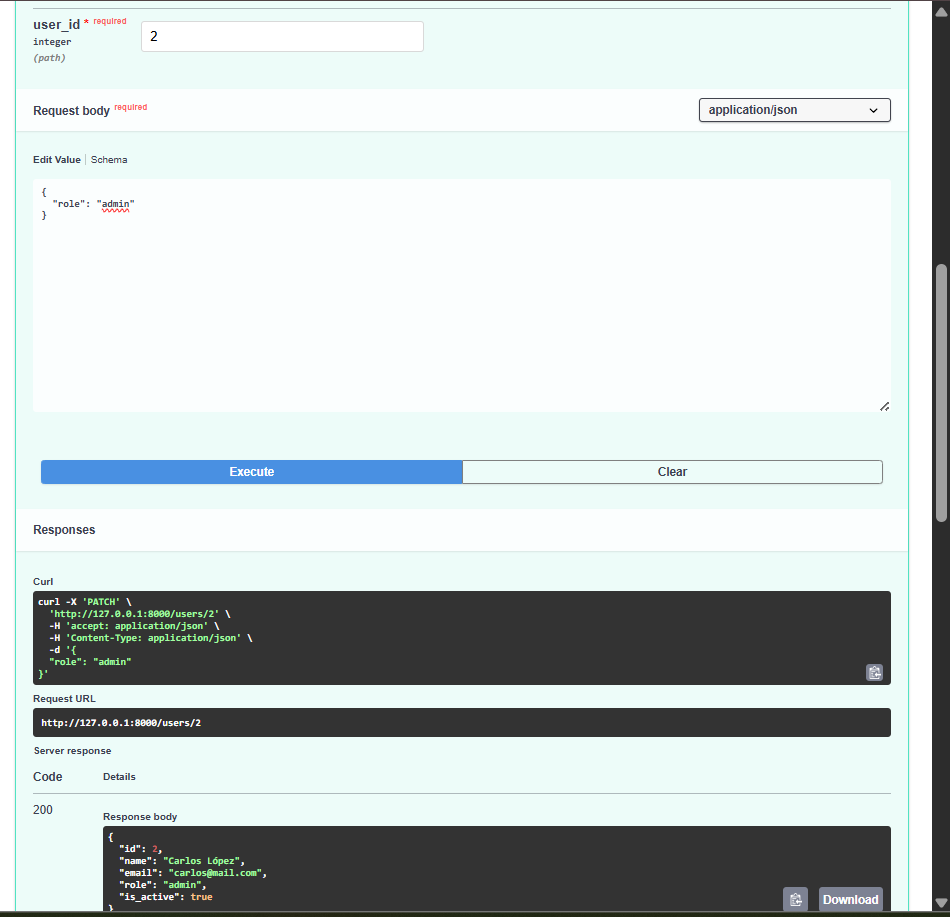
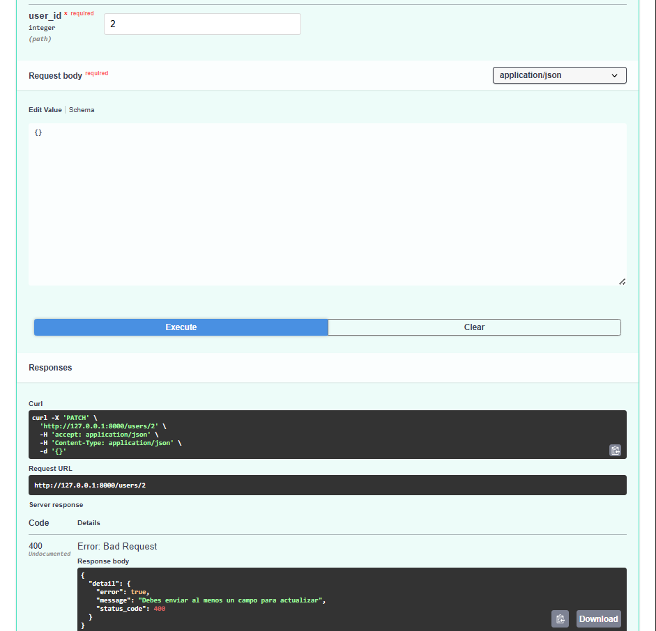
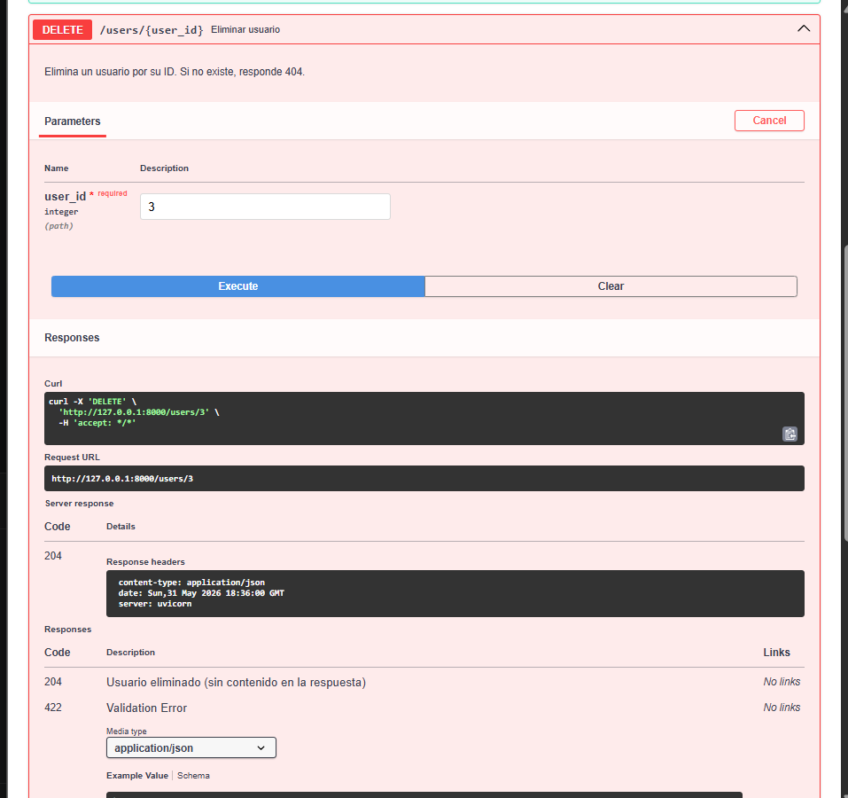
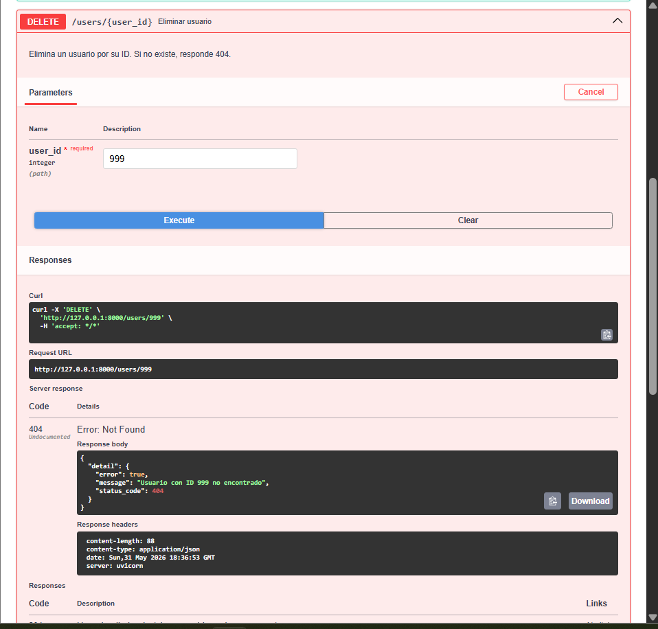
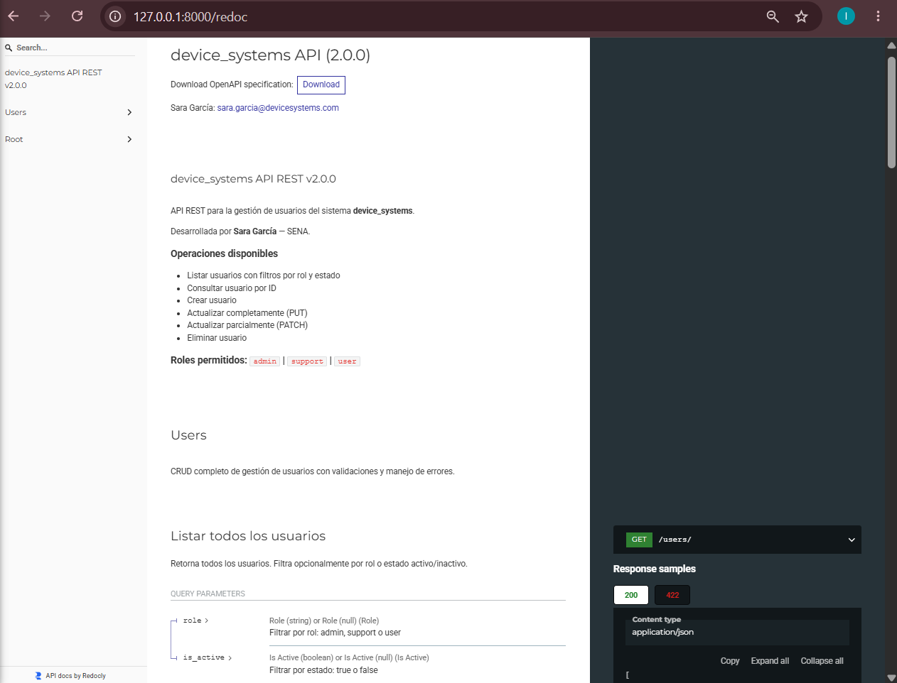

# 🖥️ device_systems API — FastAPI v2.0.0

**Autora:** Sara García  
**Actividad:** GA1-220501096-01-AA1-EV08  
**Formación:** SENA — Análisis y Desarrollo de Software

---

## 📋 Descripción

**device_systems** es una API REST desarrollada con **FastAPI** para la gestión de usuarios del sistema device_systems. Esta versión 2.0.0 implementa el CRUD completo del recurso `/users` con manejo profesional de errores, documentación automática con Swagger/OpenAPI y reutilización de lógica mediante Dependency Injection.

---

## 🛠️ Tecnologías utilizadas

| Tecnología | Versión | Descripción |
|-----------|---------|-------------|
| Python | 3.10+ | Lenguaje de programación |
| FastAPI | 0.136+ | Framework web para APIs REST |
| Uvicorn | 0.47+ | Servidor ASGI |
| Pydantic v2 | 2.x | Validación de datos y esquemas |
| Git / GitHub | — | Control de versiones |

---

## 📁 Estructura del proyecto

```
device_systems/
│── app/
│   │── main.py                   ← Configuración FastAPI + metadatos
│   │── routes/
│   │   └── user_routes.py        ← Definición de endpoints
│   │── schemas/
│   │   └── user_schema.py        ← Modelos Pydantic
│   │── services/
│   │   └── user_service.py       ← Lógica de negocio
│   │── dependencies/
│   │   └── user_dependencies.py  ← Depends() reutilizables
│   └── data/
│       └── users_db.py           ← Base de datos en memoria
│── capturas/                     ← Capturas de pantalla del proyecto
│── README.md
└── pyproject.toml
```

---

## ⚙️ Instalación y ejecución

### 1. Clona el repositorio
```bash
git clone https://github.com/urrego22/device_systems.git
cd device_systems
```

### 2. Crea y activa el entorno virtual
```bash
uv venv
.venv\Scripts\activate
```

### 3. Instala las dependencias
```bash
uv add fastapi uvicorn email-validator
```

### 4. Ejecuta el servidor
```bash
uvicorn app.main:app --reload
```

### 5. Accede a la documentación
- **Swagger UI:** http://127.0.0.1:8000/docs  
- **ReDoc:** http://127.0.0.1:8000/redoc

---

## 🔗 Tabla de Endpoints

| Método | Endpoint | Descripción | Código exitoso |
|--------|----------|-------------|----------------|
| GET | `/users` | Listar todos los usuarios (filtros opcionales) | 200 OK |
| GET | `/users/{user_id}` | Consultar usuario por ID | 200 OK |
| POST | `/users` | Crear nuevo usuario | 201 Created |
| PUT | `/users/{user_id}` | Actualizar usuario completamente | 200 OK |
| PATCH | `/users/{user_id}` | Actualizar usuario parcialmente | 200 OK |
| DELETE | `/users/{user_id}` | Eliminar usuario | 204 No Content |

### Parámetros de filtro — GET /users

| Parámetro | Tipo | Descripción |
|-----------|------|-------------|
| `role` | string | Filtrar por rol: `admin`, `support`, `user` |
| `is_active` | boolean | Filtrar por estado: `true` o `false` |

---

## 📨 Ejemplos de peticiones y respuestas

### ✅ POST /users — Crear usuario

**Request:**
```json
{
  "name": "Laura Gómez",
  "email": "laura@mail.com",
  "role": "support",
  "is_active": true
}
```

**Response 201 Created:**
```json
{
  "id": 4,
  "name": "Laura Gómez",
  "email": "laura@mail.com",
  "role": "support",
  "is_active": true
}
```

---

### ✅ PUT /users/1 — Actualización completa

**Request:**
```json
{
  "name": "Ana Torres Actualizada",
  "email": "ana.nueva@mail.com",
  "role": "admin",
  "is_active": true
}
```

**Response 200 OK:**
```json
{
  "id": 1,
  "name": "Ana Torres Actualizada",
  "email": "ana.nueva@mail.com",
  "role": "admin",
  "is_active": true
}
```

---

### ✅ PATCH /users/2 — Actualización parcial

**Request:**
```json
{
  "role": "admin"
}
```

**Response 200 OK:**
```json
{
  "id": 2,
  "name": "Carlos López",
  "email": "carlos@mail.com",
  "role": "admin",
  "is_active": true
}
```

---

### ✅ DELETE /users/3 — Eliminar usuario

**Response:** `204 No Content` *(sin cuerpo de respuesta)*

---

### ❌ Error — Usuario no encontrado (404)
```json
{
  "error": true,
  "message": "Usuario con ID 999 no encontrado",
  "status_code": 404
}
```

### ❌ Error — Correo duplicado (400)
```json
{
  "error": true,
  "message": "El correo ya está registrado",
  "status_code": 400
}
```

### ❌ Error — PATCH sin datos (400)
```json
{
  "error": true,
  "message": "Debes enviar al menos un campo para actualizar",
  "status_code": 400
}
```

---

## 📊 Códigos de estado HTTP

| Código | Nombre | Cuándo se usa |
|--------|--------|---------------|
| `200` | OK | GET, PUT, PATCH exitosos |
| `201` | Created | POST exitoso al crear usuario |
| `204` | No Content | DELETE exitoso |
| `400` | Bad Request | Correo duplicado, PATCH vacío |
| `404` | Not Found | Usuario no existe por ID |
| `422` | Unprocessable Entity | Error de validación Pydantic |

---

## 🧩 Dependency Injection con Depends()

FastAPI permite inyectar lógica reutilizable en los endpoints usando `Depends()`. En este proyecto se crearon las siguientes dependencias en `app/dependencies/user_dependencies.py`:

| Dependencia | Descripción |
|-------------|-------------|
| `get_user_or_404(user_id)` | Busca un usuario y lanza 404 automáticamente si no existe |
| `get_api_config()` | Retorna configuración general de la API |
| `verify_api_key(x_api_key)` | Simula autenticación básica mediante cabecera HTTP |

**Ejemplo de uso en una ruta:**
```python
@router.get("/{user_id}")
def get_user(user: dict = Depends(get_user_or_404)):
    return user
```

En lugar de repetir la lógica de búsqueda y validación en cada endpoint, se define **una sola vez** como dependencia y FastAPI la ejecuta automáticamente antes de entrar al endpoint. Esto elimina duplicación de código, centraliza las validaciones y hace el proyecto más fácil de mantener.

---

## 🛡️ Manejo de errores

Los errores se controlan con `HTTPException` de FastAPI. Todos retornan una respuesta estructurada consistente:

```json
{
  "error": true,
  "message": "Descripción clara del error",
  "status_code": 404
}
```

| Error controlado | Código | Descripción |
|-----------------|--------|-------------|
| Usuario no encontrado | 404 | Al buscar, actualizar o eliminar un ID inexistente |
| Correo duplicado | 400 | Al crear o actualizar con un email ya registrado |
| PATCH sin campos | 400 | Al enviar un body vacío en PATCH |
| Datos inválidos | 422 | Cuando Pydantic no puede validar el body enviado |

---

## 📸 Evidencias

### Estructura del proyecto en VS Code
> Organicé el proyecto separando las responsabilidades: los modelos de validación en `schemas/`, los endpoints en `routes/`, y el punto de entrada en `main.py`.


---

### Swagger UI generado automáticamente
> FastAPI genera esta documentación interactiva de forma automática. Desde aquí puedo probar todos los endpoints sin necesidad de Postman.


---

### GET /users — Listado completo de usuarios (200 OK)
> Implementé este endpoint para listar todos los usuarios registrados. Retorna un arreglo con los usuarios de prueba y código 200.


---

### GET /users?role=admin — Filtro por rol
> Usando un Query Parameter llamado `role`, filtré los usuarios por su rol. La API devolvió únicamente a Ana Torres, que es la única usuaria con ese rol.


---

### GET /users?is_active=false — Filtro por estado
> Con el Query Parameter `is_active=false` filtré los usuarios inactivos. La API devolvió únicamente a María Pérez.


---

### GET /users/{user_id} — Buscar por ID (200 OK)
> Al enviar el ID 1 en la ruta `/users/1`, la API devolvió correctamente los datos de Ana Torres con código 200.


---

### GET /users/999 — Error 404 usuario no encontrado
> Cuando se busca un ID que no existe, la API responde con código 404 y un mensaje de error estructurado.


---

### POST /users — Crear nuevo usuario (201 Created)
> Envié los datos de Laura Gómez en el body y la API los validó, asignó un ID automático y devolvió el usuario creado con código 201.


---

### POST /users — Error 400 correo duplicado
> La API evita registrar correos duplicados. Al intentar crear otro usuario con el mismo email, respondió con código 400.


---

### POST /users — Error 422 validación de Pydantic
> Cuando envié datos inválidos, Pydantic rechazó la solicitud automáticamente con código 422 detallando exactamente qué campo falló.


---

### Nueva estructura del proyecto v2.0.0
> Se agregaron las carpetas `services/`, `dependencies/` y `data/` para separar correctamente las responsabilidades del proyecto.



---

### Swagger UI — CRUD completo v2.0.0
> En esta versión el Swagger muestra los 6 endpoints: GET, GET por ID, POST, PUT, PATCH y DELETE, todos organizados bajo el tag Users.



---

### PUT /users/{user_id} — Actualización completa (200 OK)
> Con PUT reemplazo TODOS los campos del usuario. Se deben enviar todos los campos obligatoriamente. La API responde con 200 y los datos actualizados.



---

### PUT /users/{user_id} — No encontrado (404)
> Al intentar actualizar un usuario con ID inexistente, la dependencia `get_user_or_404` lanza el error 404 automáticamente.



---

### PATCH /users/{user_id} — Actualización parcial (200 OK)
> Con PATCH solo envío los campos que quiero modificar. En este caso únicamente el rol, y los demás campos quedan exactamente igual.



---

### PATCH /users/{user_id} — Body vacío (400)
> Si envío un body completamente vacío en PATCH, la API responde con 400 indicando que se debe enviar al menos un campo.



---

### DELETE /users/{user_id} — Eliminar usuario (204 No Content)
> El usuario es eliminado exitosamente. La respuesta 204 no tiene cuerpo, que es la práctica REST correcta para eliminaciones.



---

### DELETE /users/{user_id} — No encontrado (404)
> Al intentar eliminar un ID que no existe, la API retorna 404 con el mensaje de error estructurado.



---

### ReDoc — Documentación interactiva
> Vista alternativa de la documentación generada automáticamente por FastAPI con esquemas detallados de entrada y salida de cada endpoint.



---

## 💭 Reflexión final

Esta actividad me permitió entender cómo una API REST evoluciona desde operaciones básicas hacia una solución más completa y profesional. Los aprendizajes más importantes fueron:

**Separación de responsabilidades:** Dividir el código en `routes`, `schemas`, `services`, `dependencies` y `data` hace el proyecto mucho más fácil de mantener, escalar y entender por otros desarrolladores.

**Dependency Injection:** `Depends()` elimina la duplicación de código. En lugar de copiar la misma validación en múltiples endpoints, se escribe una sola vez y se inyecta donde se necesite. Esto sigue el principio DRY (Don't Repeat Yourself).

**Manejo de errores:** `HTTPException` permite devolver errores claros, estandarizados y estructurados. El cliente siempre sabe exactamente qué falló y con qué código.

**Swagger/OpenAPI:** La documentación automática es una herramienta poderosa. Sin escribir HTML ni documentación manual, FastAPI genera una interfaz interactiva donde cualquier desarrollador puede explorar y probar la API en segundos.

**Códigos HTTP correctos:** Usar `201 Created` para POST, `204 No Content` para DELETE, y `422` para errores de validación hace la API predecible, estándar y profesional.

---

## 🎬 Videos de demostración

[](https://youtu.be/54odRYQvzlw)

[](https://youtu.be/JibMRVahbqg)

---

*Proyecto desarrollado por **Sara García** — SENA Análisis y Desarrollo de Software*