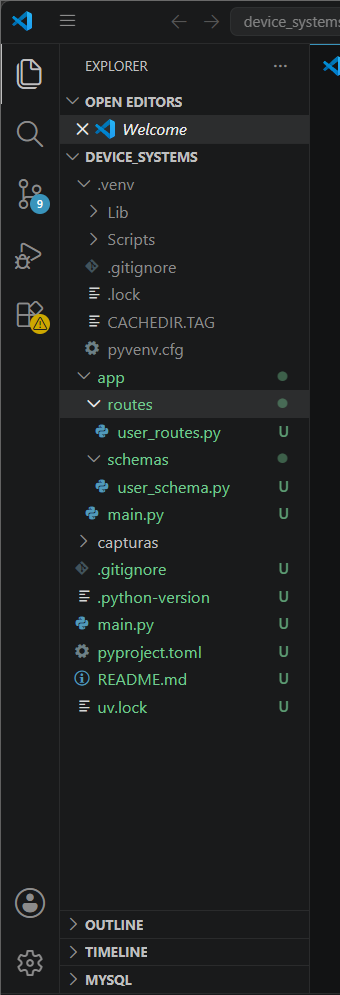
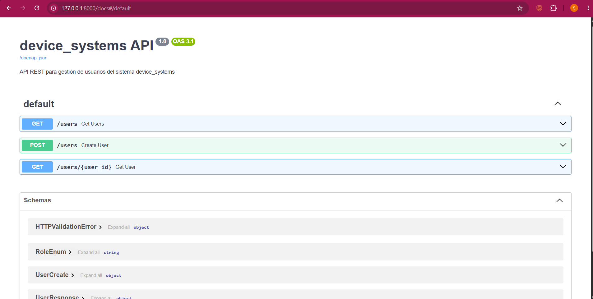
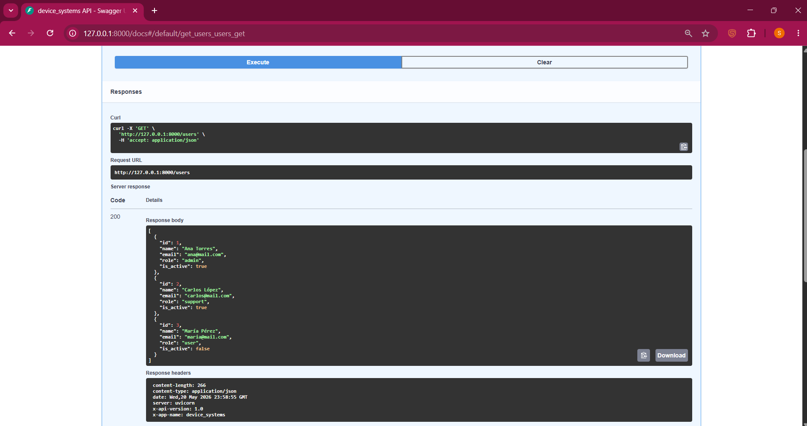
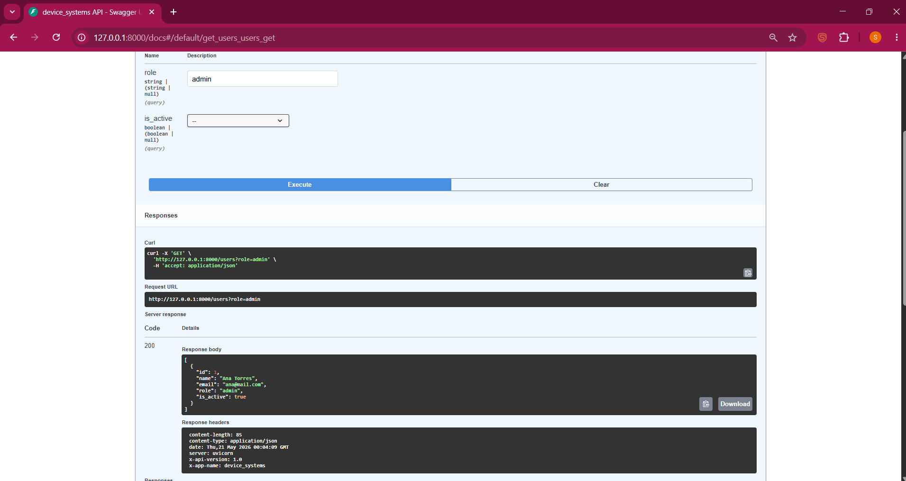
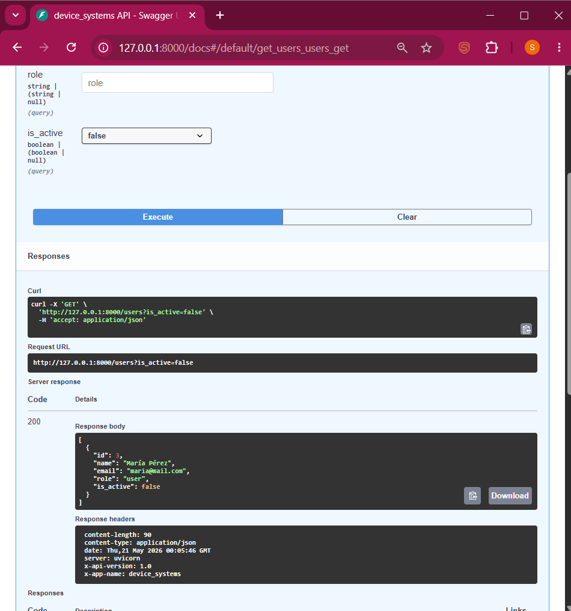
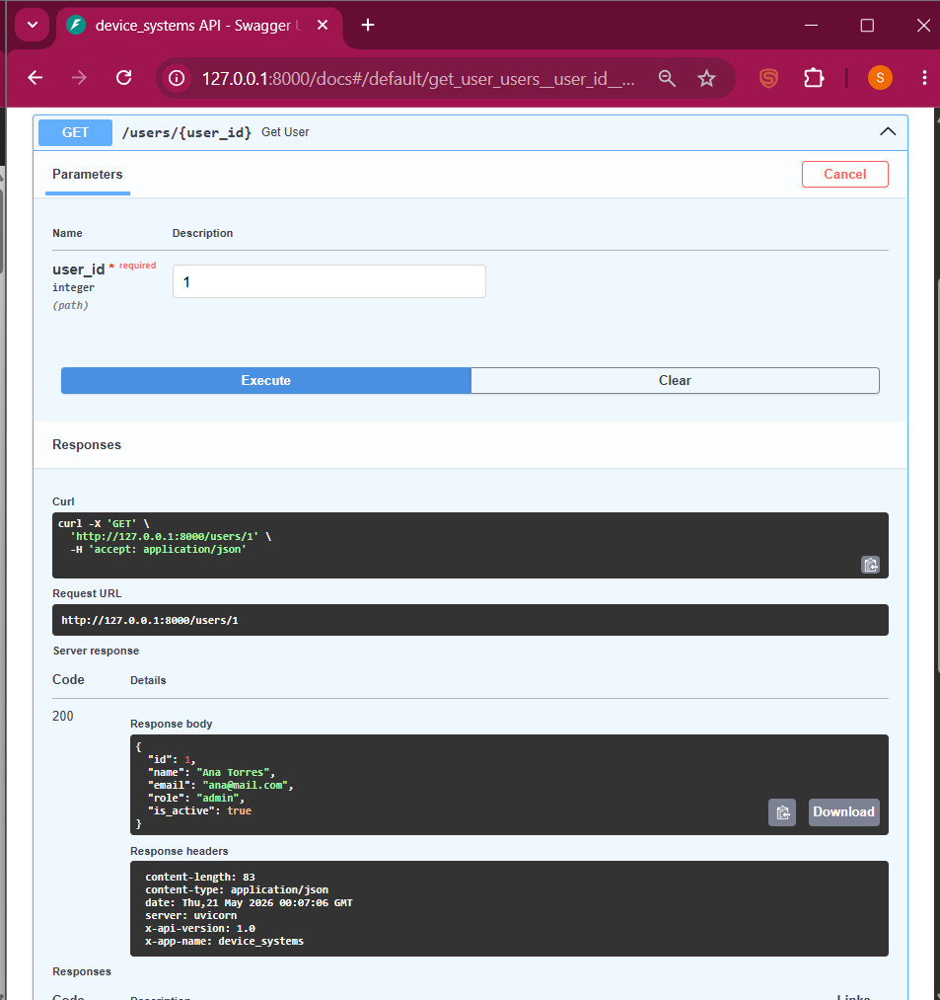
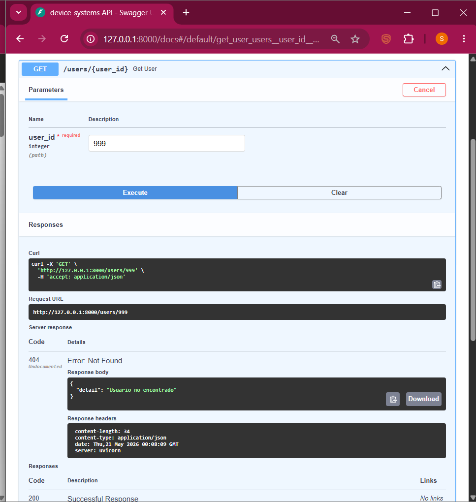
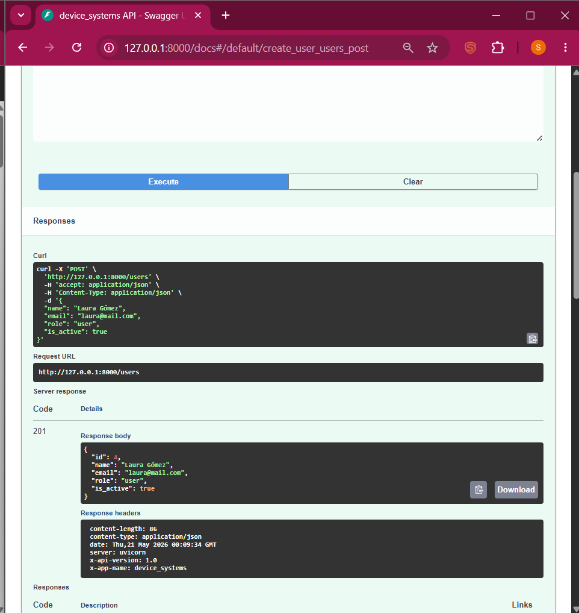
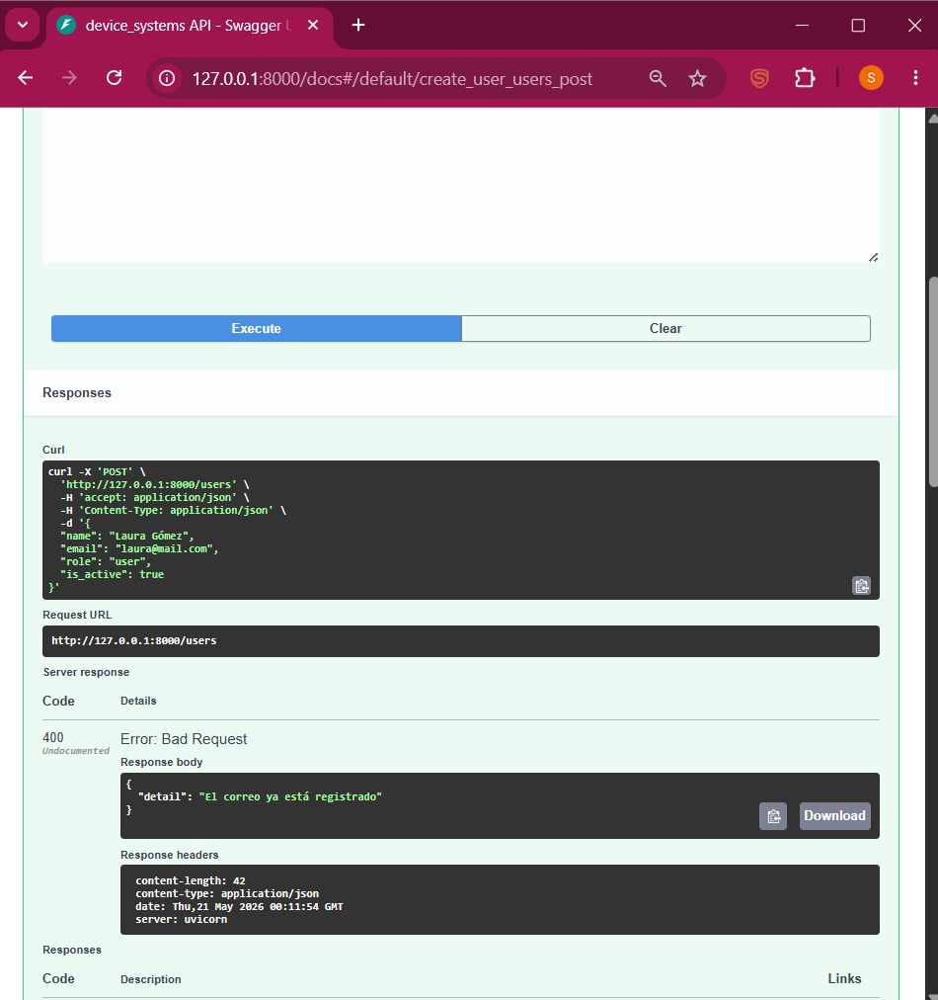
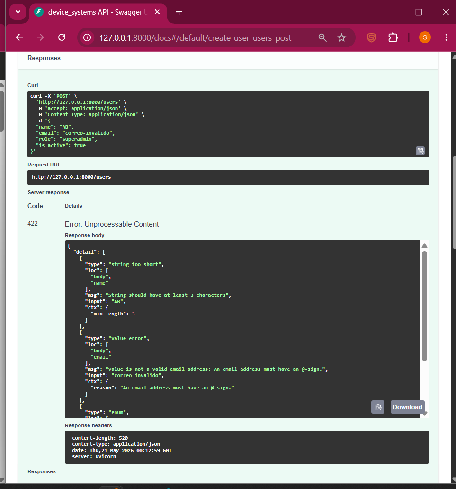

# device_systems API

**Autora:** Sara García  
**Asignatura:** GA1-220501096-01-AA1-EV07  
**Tecnología:** FastAPI + Pydantic v2 + Python

---

## Descripción

device_systems es una API REST construida con FastAPI para gestionar usuarios
de un sistema backend. Desarrollé este proyecto aplicando validaciones con
Pydantic v2, modelos de entrada y salida, parámetros de ruta y consulta,
cabeceras HTTP personalizadas y respuestas estructuradas.

---

## Instalación

```bash
uv venv
.venv\Scripts\activate
uv add fastapi uvicorn email-validator
```

---

## Ejecución

```bash
uvicorn app.main:app --reload
```

Abrir en el navegador: http://127.0.0.1:8000/docs

---

## Estructura del proyecto

```
device_systems/
├── app/
│   ├── main.py
│   ├── schemas/
│   │   └── user_schema.py
│   └── routes/
│       └── user_routes.py
├── capturas/
├── README.md
└── pyproject.toml
```

---

## Endpoints

| Método | Ruta | Descripción |
|--------|------|-------------|
| GET | /users | Listar todos los usuarios |
| GET | /users?role=admin | Filtrar usuarios por rol |
| GET | /users?is_active=false | Filtrar por estado activo/inactivo |
| GET | /users/{id} | Buscar un usuario por su ID |
| POST | /users | Crear un nuevo usuario |

---

## Evidencias

### Estructura del proyecto en VS Code
Organicé el proyecto separando las responsabilidades: los modelos de
validación en `schemas/`, los endpoints en `routes/`, y el punto de
entrada en `main.py`.



---

### Swagger UI generado automáticamente
FastAPI genera esta documentación interactiva de forma automática.
Desde aquí puedo probar todos los endpoints sin necesidad de Postman.
Se pueden ver los 3 endpoints que implementé: GET /users, POST /users
y GET /users/{user_id}.



---

### GET /users – Listado completo de usuarios
Implementé este endpoint para listar todos los usuarios registrados.
Retorna un arreglo con los 3 usuarios de prueba y código 200.
También se puede ver en las cabeceras de respuesta que incluí
`x-app-name: device_systems` y `x-api-version: 1.0`.



---

### GET /users?role=admin – Filtro por rol
Usando un Query Parameter llamado `role`, filtré los usuarios por su
rol. En este caso envié `role=admin` y la API devolvió únicamente
a Ana Torres, que es la única usuaria con ese rol.



---

### GET /users?is_active=false – Filtro por estado
Con el Query Parameter `is_active=false` filtré los usuarios inactivos.
La API devolvió únicamente a María Pérez, que es la única usuaria
con el campo `is_active` en false.



---

### GET /users/{user_id} – Buscar por ID
Implementé este endpoint usando un Path Parameter. Al enviar el
ID 1 en la ruta `/users/1`, la API devolvió correctamente los datos
de Ana Torres con código 200.



---

### GET /users/999 – Error 404 usuario no encontrado
Cuando se busca un ID que no existe, la API responde con código 404
y el mensaje "Usuario no encontrado". Esto lo implementé con
`HTTPException` en FastAPI.



---

### POST /users – Crear nuevo usuario
Implementé este endpoint para registrar nuevos usuarios. Envié los
datos de Laura Gómez en el cuerpo de la solicitud y la API los
validó, asignó un ID automático y devolvió el usuario creado con
código 201.



---

### POST /users – Error 400 correo duplicado
La API evita registrar correos duplicados. Cuando intenté crear otro
usuario con el mismo email `laura@mail.com`, respondió con código 400
y el mensaje "El correo ya está registrado".



---

### POST /users – Error 422 validación de Pydantic
Cuando envié datos inválidos (nombre muy corto, email sin @, rol no
permitido), Pydantic rechazó la solicitud automáticamente con código
422 y detalló exactamente qué campo falló y por qué. Esto lo logré
definiendo las reglas una sola vez en el modelo `UserCreate`.



---

## Video de demostración

[Ver video en YouTube](https://youtu.be/54odRYQvzlw)

---

## Reflexión

Desarrollar este proyecto me permitió entender cómo funciona FastAPI
para construir APIs REST de forma rápida y ordenada. Lo que más me
gustó fue la validación automática con Pydantic, porque solo defino
las reglas una vez en el modelo y FastAPI las aplica solas en todos
los endpoints. También me pareció muy útil que Swagger UI se genere
automáticamente, lo que me ahorra tiempo al probar la API. En general,
FastAPI es una herramienta muy poderosa y fácil de aprender para
construir backends modernos en Python.